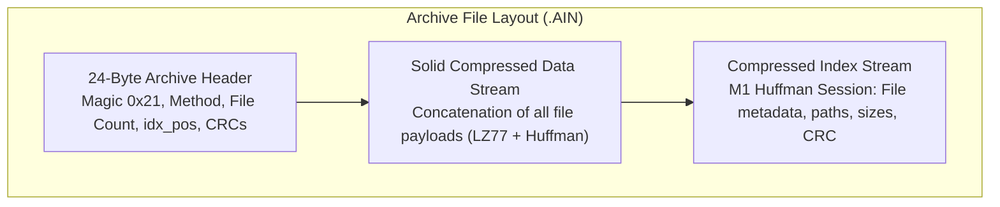
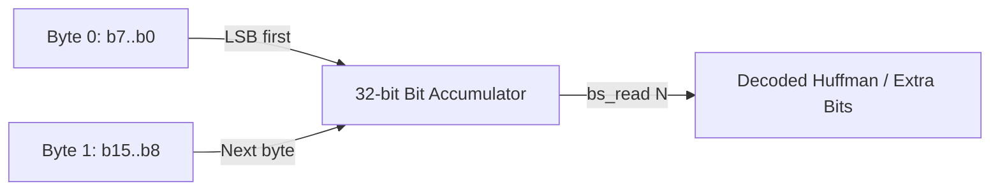
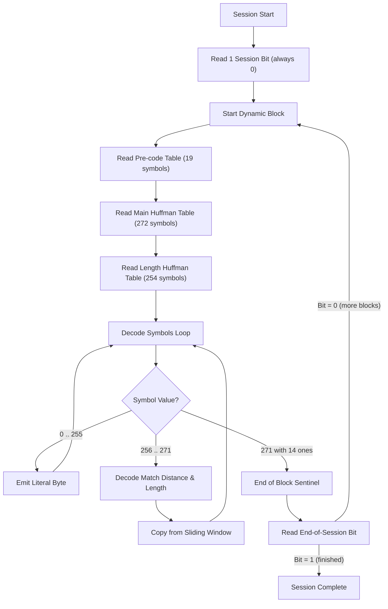
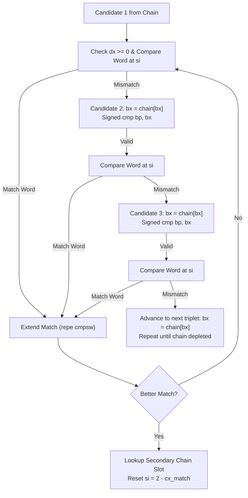
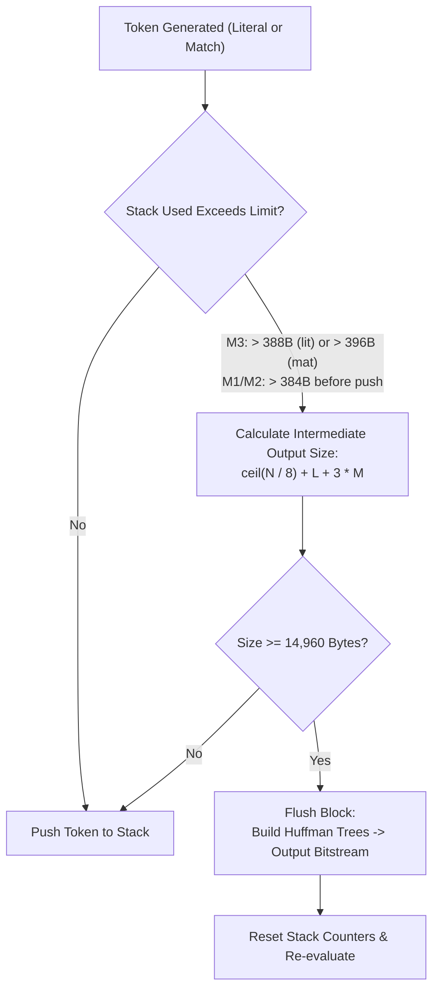

# Transas AIN 2.32 Archive Format & Engine Specification

**Author:** Pure C reverse-engineering and reimplementation by [seb3773](https://github.com/seb3773/AIN)  
**Historical Origin:** Transas Marine Ltd. (1993–1996)  
**Status:** Complete, bit-exact reverse-engineered specification.  
**Legal Notice:** This reverse-engineering work was conducted strictly for the purposes of software interoperability and digital data preservation (under European Directive 2009/24/EC) to reconstruct the prediction, compression, and decompression algorithms of an obsolete historical archive format.

---

## 1. Architectural Overview

AIN 2.32 is a high-ratio, single-pass historical DOS archiver designed around a **solid LZ77 compression stream** coupled with **per-block dynamic canonical Huffman coding**.

Unlike ZIP or ARJ which traditionally compress each file independently, AIN concatenates all archived files into a single, seamless data stream. A separate compressed metadata index at the end of the archive describes directory trees, file sizes, DOS timestamps, and integrity checksums.



### Key Principles

1. **Solid Compression**: All files share the 32 KB sliding window across file boundaries, maximizing compression redundancy across similar files.
2. **Dedicated Metadata Index**: The index is stored at file offset `idx_pos` and compressed as an independent **Method 1** Huffman session.
3. **16-bit Sliding Arithmetic**: The historical DOS implementation operates within 16-bit x86 real-mode segment constraints, relying on signed integer wrap-around for sliding-window boundary management.

---

## 2. Archive Container & Headers

### 2.1 The 24-Byte File Header

Every AIN archive (and multi-volume fragment) begins with a mandatory 24-byte binary header:

| Byte Offset | Size | Type | Field Name | Description |
|---|---|---|---|---|
| `0x00` | 1 | `uint8` | `magic` | Constant `0x21` (`'!'`) |
| `0x01` | 1 | `uint8` | `method` | Compression method: `0x11` (M1 Ultra), `0x12` (M2 Normal), `0x13` (M3 Fast), `0x14` (M4 Store) |
| `0x02` | 1 | `uint8` | `reserved1` | Reserved (`0x00`) |
| `0x03` | 1 | `uint8` | `flags` | Bit `0x40`: Multi-volume archive flag (more volumes follow) |
| `0x04..0x05` | 2 | `uint16 LE` | `reserved2` | Reserved (`0x0000`) |
| `0x06..0x07` | 2 | `uint16 LE` | `vol_idx` | Volume sequence index (`0` for base volume, `1` for `.A01`, `2` for `.A02`, ...) |
| `0x08..0x09` | 2 | `uint16 LE` | `n_files` | Total number of files archived in the set |
| `0x0A..0x0D` | 4 | `uint32 LE` | `timestamp` | Archive creation timestamp (Standard DOS bit-packed datetime) |
| `0x0E..0x11` | 4 | `uint32 LE` | `idx_pos` | Byte offset where the compressed index stream starts (`0` in intermediate split volumes) |
| `0x12..0x13` | 2 | `uint16 LE` | `idx_crc` | Arithmetic sum of all compressed index bytes: `sum(idx_bytes) & 0xFFFF` |
| `0x14..0x15` | 2 | `uint16 LE` | `reserved3` | Reserved (`0x0000`) |
| `0x16..0x17` | 2 | `uint16 LE` | `hdr_crc` | Header checksum: `(sum(hdr[0..21]) & 0xFFFF) ^ 0x5555` |

#### Header Checksum Calculation
The original DOS `AIN.EXE` strictly validates the final 2 bytes:
```c
uint16_t calc_hdr_crc(const uint8_t *hdr22) {
    uint16_t s = 0;
    for (int i = 0; i < 22; i++) s += hdr22[i];
    return s ^ 0x5555u;
}
```
If this checksum does not match, the DOS binary immediately halts with `%s is not an AIN archive`.

---

### 2.2 Decompressed Index Format

When decompressed (via Method 1 decompression), the index stream consists of contiguous, variable-length records, one per archived file:

```
[Entry Header: 29 bytes] + [Relative Path: variable ASCII] + [NUL: 0x00] + [Optional Pad: 0x00]
```

| Offset | Size | Type | Field Name | Description |
|---|---|---|---|---|
| `0x00` | 1 | `uint8` | `entry_flag` | `0x20` for first entry, `0x00` for subsequent entries |
| `0x01..0x04` | 4 | `uint32 LE` | `dos_time` | Standard DOS timestamp: bits [31:25] year-1980, [24:21] month, [20:16] day, [15:11] hour, [10:5] min, [4:0] sec/2 |
| `0x05..0x08` | 4 | `uint32 LE` | `orig_size` | Uncompressed original file size in bytes |
| `0x09..0x0C` | 4 | `uint32 LE` | `comp_size` | Solid stream size (set to total compressed size on last entry, `0` on intermediate entries) |
| `0x0D` | 1 | `uint8` | `flags` | `0x18` for first entry, `0x00` for subsequent entries |
| `0x0E..0x15` | 8 | bytes | `reserved` | Reserved zeroes |
| `0x16` | 1 | `uint8` | `attr` | Attribute flags: `0x18` (single file archive), `0x10` (first entry), `0x08` (last entry) |
| `0x17..0x1A` | 4 | bytes | `reserved` | Reserved zeroes |
| `0x1B..0x1C` | 2 | `uint16 LE` | `checksum` | File/stream checksum: `sum(stream_bytes) & 0xFFFF` (stored on last entry) |
| `0x1D..` | var | `char[]` | `filename` | NUL-terminated DOS path (`SUBDIR\FILE.EXT`) |
| `end` | 0..1 | `uint8` | `padding` | Optional trailing zero byte if alignment boundary requires it |

---

## 3. Bitstream & Huffman Compression Architecture

All compressed payloads (both solid data and the index section) share the exact same bitstream layer.

### 3.1 Bitstream Reader & Writer

- **Ordering**: LSB-first bit ordering.
- **Buffer**: 32-bit integer accumulator refilled 8 bits at a time.
- **Reading**: To read $N$ bits ($1 \le N \le 16$), take `accum & ((1 << N) - 1)` then `accum >>= N`.



---

### 3.2 Block & Session Structure

A stream is divided into **sessions** (one session per uncompressed file stream), and each session is composed of one or more **dynamic Huffman blocks**.



---

### 3.3 The Three Huffman Tables

Every block dynamically transmits three canonical Huffman trees:

1. **Pre-code Table (`pre_tbl`) — 19 symbols**:
   - Used to decode the run-length encoded (RLE) code-length representations of the Main and Length tables.
   - Header specifies: `n_pre = bs_read(5)` (number of active pre-code symbols, max 19).
   - Each symbol's code length is transmitted as a raw 3-bit value: `len = bs_read(3)`.

2. **Main Table (`sym_tbl`) — 272 symbols**:
   - Symbols `0 .. 255`: Literal byte outputs.
   - Symbols `256 .. 271`: Match distance classes (`D0 .. D15`).
   - Symbol `271` with 14 extra bits of `1` (`0x3FFF`) represents the **End-Of-Block (EOB)** sentinel.

3. **Length / Distance Table (`dist_tbl`) — 254 symbols**:
   - Symbols `0 .. 253`: Match length codes.
   - Output length is: $\text{length} = \text{symbol} + 3$ (ranges from 3 to 256 bytes).

---

### 3.4 Code Length RLE Encoding State Machine

To efficiently transmit table lengths, lengths are compressed using a custom Run-Length Encoding (RLE) scheme decoded by the Pre-code table:

| Pre-code Symbol | Extra Bits | Decoded Output |
|---|---|---|
| `0` | None | Literal code length `0` (1 zero) |
| `1` | `bs_read(4)` | Run of $(bits + 3)$ zeroes (repetition of 3 to 18 zeroes) |
| `2` | `bs_read(9)` | Run of $(bits + 20)$ zeroes (repetition of 20 to 531 zeroes) |
| `3 .. 18` | None | Literal code length = $(\text{symbol} - 2)$ (lengths 1 to 16) |

> [!IMPORTANT]
> **The Run = 19 Singularity:**  
> A zero run of exactly 19 is not directly representable (Symbol 1 maxes at 18; Symbol 2 starts at 20). The compressor must explicitly decompose a run of 19 into:  
> `Symbol 1 (extra = 15 -> run of 18)` followed immediately by `Symbol 0 (run of 1)`.

---

### 3.5 Distance Decoding Class Mapping

When a symbol in `[256 .. 271]` is encountered in the main table, it defines a distance class $D = \text{symbol} - 256$:

| Class $D$ | Extra Bits Read | Decoded Window Distance | Offset Formula |
|---|---|---|---|
| `0` | 0 | **1** | $1$ |
| `1` | 0 | **2** | $2$ |
| `2` | 1 | **3 .. 4** | $(1 \ll 1) \mid \text{extra} + 1$ |
| `3` | 2 | **5 .. 8** | $(1 \ll 2) \mid \text{extra} + 1$ |
| `4` | 3 | **9 .. 16** | $(1 \ll 3) \mid \text{extra} + 1$ |
| ... | ... | ... | ... |
| $D$ ($2 \le D \le 14$) | $D - 1$ | $2^{D-1} + 1 \;..\; 2^D$ | $(1 \ll (D - 1)) \mid \text{extra} + 1$ |
| `15` | 14 | **16385 .. 32768** | $(1 \ll 14) \mid \text{extra} + 1$ |
| `15` (Sentinel) | 14 bits = `0x3FFF` | **EOB Marker** | Signals End-Of-Block |

---

## 4. LZ77 Engine & Sliding Window

### 4.1 Window Geometry & Overrun Buffer

- **Sliding Window Size**: 32,768 bytes (`0x8000`).
- **Overrun / Lookahead Buffer**: 256 bytes (`0x0100`).
- **Total In-Memory Buffer**: 33,024 bytes (`0x8100`).

Matches can reach backward up to 32,768 bytes into the decoded stream history.

```
+------------------------------------------------------+----------------+
|       History Sliding Window (32,768 bytes)          | Overrun (256B) |
+------------------------------------------------------+----------------+
0x0000                                               0x8000           0x8100
```

---

### 4.2 Compression Modes & Algorithms

AIN 2.32 offers four distinct compression modes:

| Mode | Historical Name | Window Size | Search Strategy | Max Hash Chain |
|---|---|---|---|---|
| **M1** | Ultra | 32 KB | Lazy Evaluation (Deferred emission) | 4,096 |
| **M2** | Normal | 32 KB | Greedy with 3-Way Unrolled Fast Match | 32 |
| **M3** | Fast | 32 KB | Greedy 4-gram Hash Table with Sentinels | 4 or 16 |
| **M4** | Store | 0 KB | No compression (raw copy into stream) | 0 |

---

### 4.3 Mode M3 Hash Algorithm (4-Gram with 16-bit Assembly Rotation)

Mode M3 calculates a 16-bit slot index directly from the first 4 bytes of input using 16-bit x86 register arithmetic:

```c
uint16_t lz_hash_m3(const uint8_t *p) {
    uint16_t word1 = (uint16_t)(p[0] | (p[1] << 8));
    uint16_t word2 = (uint16_t)(p[2] | (p[3] << 8));
    
    /* ror16(word2, 1) */
    uint16_t ror_w2 = (uint16_t)((word2 >> 1) | (word2 << 15));
    uint16_t bx = (uint16_t)(ror_w2 - word1);
    
    /* sbb bl, bh: borrow arithmetic */
    uint8_t bl = (uint8_t)(bx & 0xFF);
    uint8_t bh = (uint8_t)(bx >> 8);
    uint8_t cf = (ror_w2 < word1) ? 1u : 0u;
    bl = (uint8_t)(bl - bh - cf);
    
    bx = (uint16_t)(((uint16_t)bh << 8) | bl);
    bx = (uint16_t)(bx * 4u); /* 16-bit wraparound */
    
    return (uint16_t)(bx >> 2); /* Slot index in [0..16383] */
}
```

---

### 4.4 Mode M1 & M2 Rolling Hash Algorithm

Modes M1 and M2 utilize an iterative, rolling 4,096-slot hash table where previous state `bx_slot` is maintained across calls:

```c
uint16_t lz12_hash_step(uint16_t prev_bx_slot, uint8_t byte2) {
    uint16_t bx = (uint16_t)(prev_bx_slot << 3);
    uint8_t bl = (uint8_t)bx + byte2;               /* 8-bit add, no carry into bh */
    uint8_t bh = (uint8_t)(bx >> 8) & 0x0Fu;        /* mask high nibble */
    bx = ((uint16_t)bh << 8) | bl;
    bx = (uint16_t)(bx * 2u);                       /* byte offset into table */
    return bx;                                      /* slot index = bx >> 1 */
}
```

---

### 4.5 Mode M2 3-Way Unrolled Search Optimization

One of the most complex components reverse-engineered from `AIN_UNP.EXE` is the **3-way candidate loop unrolling** (`D420`):



- **Early Rejection**: Before performing full string comparisons, Candidates 1, 2, and 3 check a single 16-bit word at offset `si = best - 1`. If that boundary word does not match, the candidate is discarded in 3 CPU cycles.
- **Secondary Chain Leap**: When an improved match is discovered, the search jumps to an alternate hash chain slot computed from the match length, accelerating discovery of longer runs.

---

### 4.6 Sliding Window Sentinel Arithmetic

In the 16-bit DOS binary, the absolute position counter `bp` monotonically increments from `0x0200` to `0xFFFF` and wraps to `0x0000`. Memory is never reallocated or copied backward.

Instead, an alternating sentinel `[0xC408]` (cycling between `0x8000` and `0x0000`) marks the active window:
- When $(bp - \text{sentinel}) \le 0x0100$, a **Slide** triggers.
- The hash table is swept: any entry $H$ satisfying $(int16_t)(H - \text{new\_sentinel}) < 0$ is clamped to `new_sentinel`.
- Outdated candidate references automatically fail the signed distance check `(int16_t)(bp - cand) < 0` without requiring chain purging.

---

## 5. Block Flush Heuristics (Dynamic Partitioning)

AIN buffers LZ77 tokens (literals and match tuples) in a temporary memory stack before constructing Huffman trees and flushing a block to the bitstream.



- $N$: Number of token type flag bits.
- $L$: Total literal bytes.
- $M$: Total match pairs.
- **Threshold**: When estimated compressed block footprint reaches **14,960 bytes** (`0x4DF4`), the block is sealed, trees are generated, and the payload is emitted.

---

## 6. Self-Extracting (SFX) Formats

AIN archives can be transformed into standalone executables via embedded SFX stubs:

### 6.1 Historical DOS SFX (`.EXE`)
- Standard DOS MZ executable with 16-bit real-mode decompression stub (`AINEXT.EXE`).
- Payload begins at fixed file offset **`0x34`** (52 decimal).

### 6.2 Modern Native Linux SFX (`.SFX`)
- Freestanding 64-bit ELF executable (`x86_64`).
- Inspects `/proc/self/exe` and parses the ELF Program Headers (`Elf64_Phdr`).
- Locates the appended AIN payload immediately past the end of the highest ELF segment:
  $$\text{Offset} = \max(\text{p\_offset} + \text{p\_filesz})$$
- Automatically restores execute permissions (`0755`) and supports multi-volume chaining (`.sfx` + `.a01`, `.a02`, ...).

---

## 7. Multi-Volume Fragment Architecture

When split via `-f<size>`, AIN slices the continuous solid stream across separate files:

```
archive.ain (or .sfx / .exe)  -> Volume 0  (24-byte header + Slice 0)
archive.a01                   -> Volume 1  (24-byte header + Slice 1)
archive.a02                   -> Volume 2  (24-byte header + Slice 2)
...
archive.aNN                   -> Volume NN (24-byte header + Slice NN + Compressed Index)
```

- Intermediate volumes have header flag `0x40` set and `idx_pos = 0`.
- The final volume contains `idx_pos` pointing to the decompressed index section.
- Decompressors transparently discover and stitch slices into a single continuous stream during extraction.

---

## 8. Summary of Constants & Signatures

| Constant | Value | Description |
|---|---|---|
| `MAGIC_AIN` | `0x21` | Mandatory first byte of all AIN headers |
| `METHOD_M1` | `0x11` | Ultra compression (Lazy LZ77, 4096 hash chain) |
| `METHOD_M2` | `0x12` | Normal compression (3-way unrolled LZ77, 32 chain) |
| `METHOD_M3` | `0x13` | Fast compression (Greedy 4-gram) |
| `METHOD_M4` | `0x14` | Store mode (uncompressed) |
| `HDR_CRC_XOR` | `0x5555` | XOR mask for 22-byte header checksum |
| `EOB_MARKER` | `0x3FFF` | 14-bit marker on symbol 271 signalling End-Of-Block |
| `BLOCK_LIMIT` | `14,960` | Byte threshold for intermediate buffer block flush |
| `WINDOW_SIZE` | `32,768` | LZ77 sliding history window size (`0x8000`) |
| `OVERRUN_SIZE`| `256` | Overrun / lookahead buffer size (`0x0100`) |
| `MAX_MATCH` | `256` | Maximum match length ($253 + 3$) |
| `MIN_MATCH` | `3` | Minimum match length ($0 + 3$) |
| `N_SYMS_MAIN` | `272` | Main Huffman alphabet (256 literals + 16 distance classes) |
| `N_SYMS_LEN` | `254` | Match length Huffman alphabet |
| `N_SYMS_PRE` | `19` | Pre-code Huffman alphabet |
